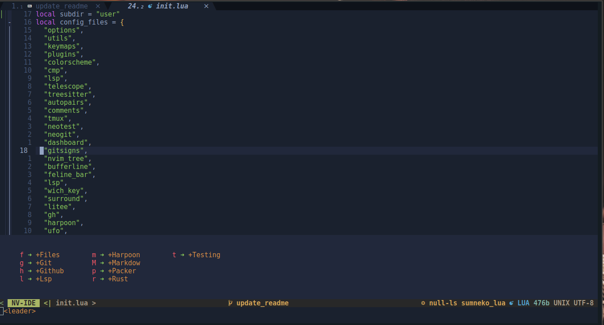
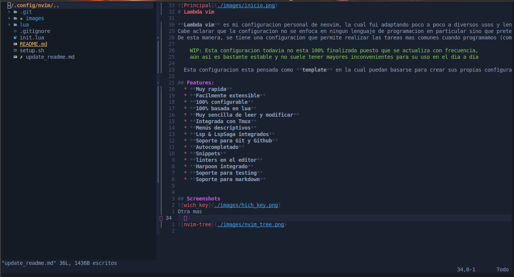
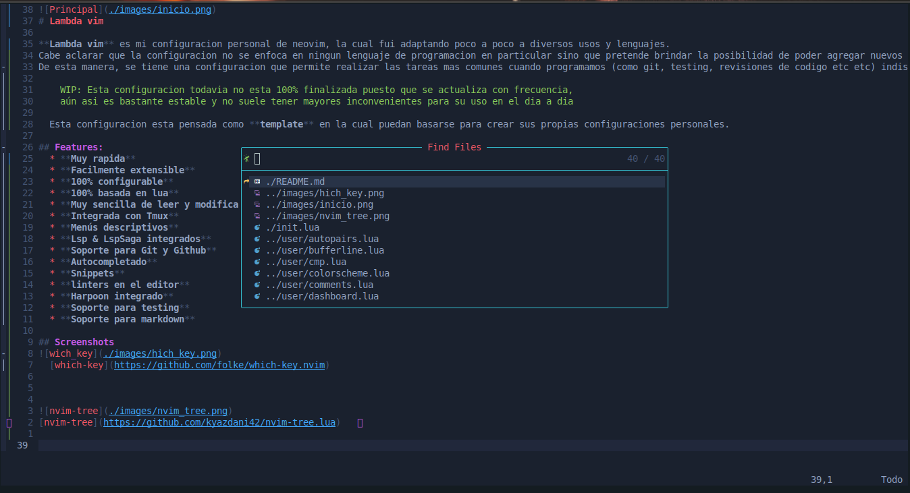
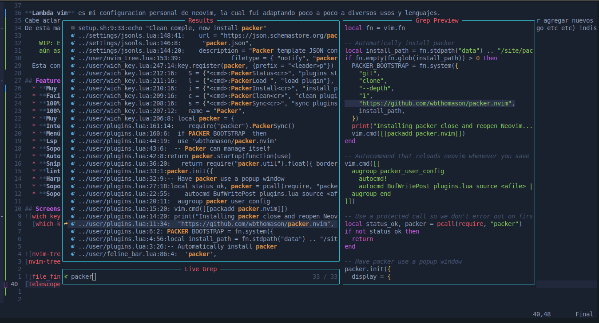
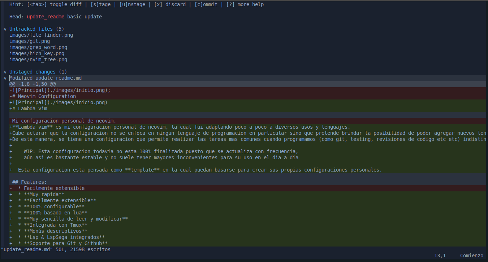
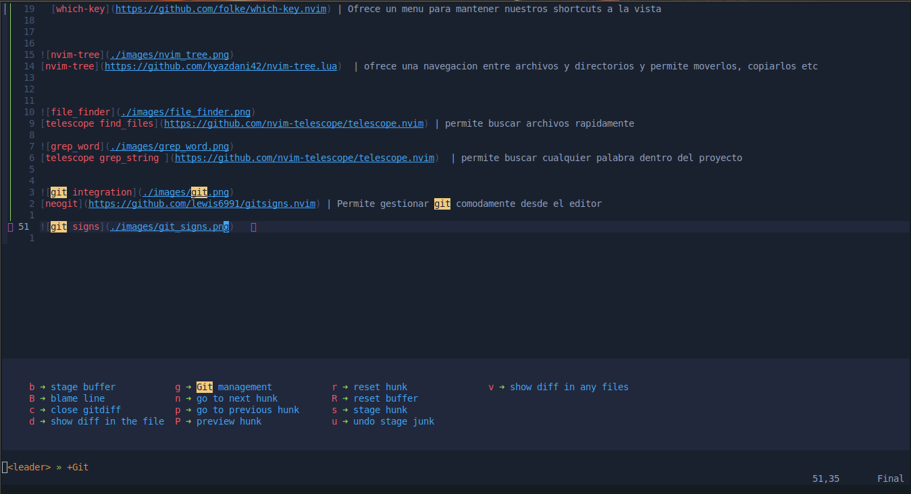
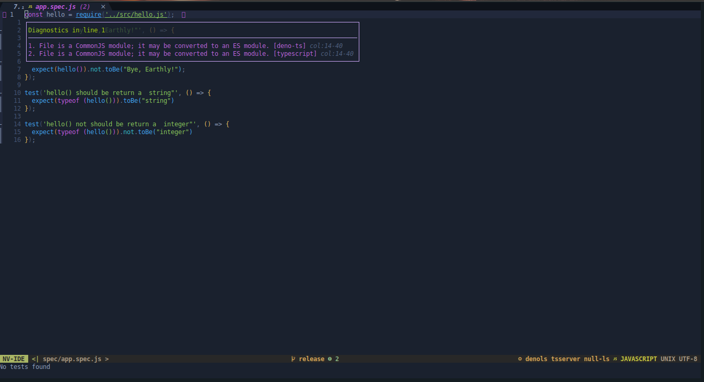
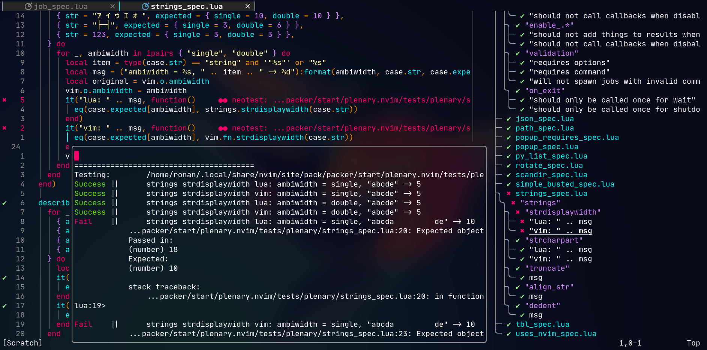

# Lambda vim

**Lambda vim** es mi configuracion personal de neovim, la cual fui adaptando poco a poco a diversos usos y lenguajes.
Cabe aclarar que la configuracion no se enfoca en ningun lenguaje de programacion en particular sino que pretende brindar la posibilidad de poder agregar nuevos lenguajes a medida que vayamos necesitandolos.
De esta manera, se tiene una configuracion que permite realizar las tareas mas comunes cuando programamos (como git, testing, revisiones de codigo etc etc) indistintamente del lenguaje utilizado.

    WIP: Esta configuracion todavia no esta 100% finalizada puesto que se actualiza con frecuencia,
    aún asi es bastante estable y no suele tener mayores inconvenientes para su uso en el dia a dia

  Esta configuracion esta pensada como **template** en la cual puedan basarse para crear sus propias configuraciones personales.

# Instalacion

Para instalar es tan facil como copiar y pegar esta linea en la terminal (es necesario tener git y curl instalados previamente)

```sh
curl -s https://raw.githubusercontent.com/idcmardelplata/neovim_configuration/master/setup.sh | bash
```

El comando anterior descargara e instalara esta configuracion **reemplazando a la configuracion existente**, por lo cual **asegurese de hacer un backup de su configuracion existente** de neovim antes de ejecutar el comando anterior.

## Features:
  * **Muy rapida**
  * **Facilmente extensible**
  * **100% configurable**
  * **100% basada en lua**
  * **Muy sencilla de leer y modificar**
  * **Integrada con Tmux**
  * **Menús descriptivos**
  * **Lsp & LspSaga integrados**
  * **Soporte para Git y Github**
  * **Autocompletado**
  * **Snippets**
  * **linters en el editor**
  * **Harpoon integrado**
  * **Soporte para testing**
  * **Soporte para markdown**

## Screenshots
 
  [which-key](https://github.com/folke/which-key.nvim) | Ofrece un menu para mantener nuestros shortcuts a la vista



[nvim-tree](https://github.com/kyazdani42/nvim-tree.lua)  | ofrece una navegacion entre archivos y directorios y permite moverlos, copiarlos etc



[telescope find_files](https://github.com/nvim-telescope/telescope.nvim) | permite buscar archivos rapidamente


[telescope grep_string ](https://github.com/nvim-telescope/telescope.nvim)  | permite buscar cualquier palabra dentro del proyecto



[neogit](https://github.com/lewis6991/gitsigns.nvim) | Permite gestionar git comodamente desde el editor

 
[git signs](https://github.com/lewis6991/gitsigns.nvim) 

 
[lsp_saga](https://github.com/glepnir/lspsaga.nvim) | Permite una mejor interaccion con lsp 


[noetest](https://github.com/nvim-neotest/neotest)  | neotest support


# Keybindings
Estos mapeos de teclados son generales y no estan atados a ningun plugin en particular

**leaderkey = < Space >**

#### movimiento entre ventanas
 **```<C-l>```**= se mueve hacia la derecha

 **```<C-h>```**= se mueve hacia la izquierda

 **```<C-j>```**= se mueve hacia abajo

 **```<C-k>```**= se mueve hacia arriba

#### Redimienciona el tamaño de las ventanas
 **```<C-Up>```**= Redimienciona hacia arriba

 **```<C-Down>```**= Redimienciona hacia abajo

 **```<C-Left>```**= Redimienciona hacia la izquierda

 **```<C-Right>```**= Redimienciona hacia la derecha

#### Navegacion entre buffers
 **```<S-l>```**= Buffer siguiente

 **```<S-h>```**= Buffer previo

#### Movimiento de texto
 **```<A-j>```**= mueve una linea hacia abajo
 
 **```<A-k>```**= mueve una linea hacia arriba

 **```<```**= mueve un bloque de texto hacia la izquierda en modo visual

 **```>```**= mueve un bloque de texto hacia la derecha en modo visual

#### Salir del modo inserción
 **```jk```**= sale del modo insercion


#### Mapeos para la terminal Integrada
 **```<C-t>```**= activa el menu para abrir la terminal en diversos modos

### Varios
 **```<C-s>```**= guarda el fichero

 **```<C-Space>```** limpia el resaltado de busqueda


Los mapeos para los plugins estan todos visibles en wich-key.


Si te sirve o te gusta lambda vim, te invito a colaborar mediante issues o pull request **¡todas son bienvenidas! :)**

happy coding :) :)
